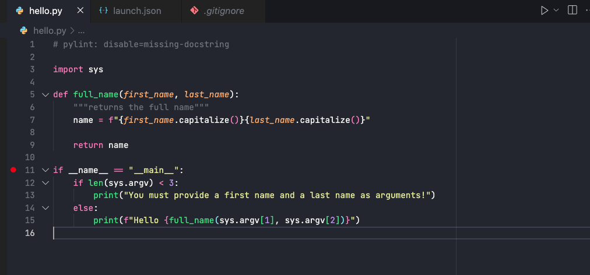
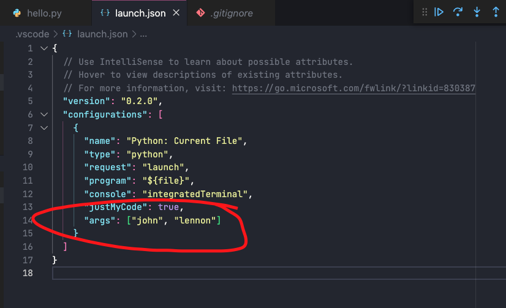

# Debugging in Python

This repo is supposed to give you a small introduction to the world of debugging using VS Code's built-in debugger

## Necessary preparation

In order to use the VS Code debugger for Python, you need to install the official Microsoft Python Extension for VSCode. You can do so by opening the extensions panel on the left (it looks like a block of bricks) and search for 'Python' in the search field, then installing the extension.

Also, to check your code after the completion, you need the pylint and pytest modules installed. In order to do that, run the following command in your terminal.

```bash
pip install pylint pytest
```

## What is debugging?

Debugging is the process of _finding_ and _resolving_ problems in your code. As [Wikipedia](https://en.wikipedia.org/wiki/Debugging) puts it, debugging tactics:

> [...] can involve **interactive** debugging, control flow analysis, unit testing, integration testing, log file analysis, monitoring at the application or system level, memory dumps, and profiling.

In this exercise, we will focus on interactive debugging & control flow analysis, which are the basics of debugging.

## Python Debuggers

Today, we are going to use the interactive VS Code debugger, which is the easiest and most convenient way of debugging python code, as it does not require you to manipulate your code in order to work. Imho nothing is more annoying then having to specify an additioal import and include breakpoints as part of your code in order to use Python's built-in debugger, all of which have to be deleted after debugging.

If you want to refresh your memory, you can have a look at [this article on how to set up and use the VS Code debugger for Python](https://towardsdatascience.com/how-to-make-most-of-your-python-debugger-in-vscode-9e05dfce533f).

If you want to find out more about how you can configure the Python debugger using the `launch.json` file, consider the [official VS Code documentation](https://code.visualstudio.com/docs/python/debugging).

If you ever find yourself in an environment where you need to debug a Python file but don't have VSCode available - for example on a virtual machine, in an SSH connection or similar - you can use the built-in debugger called `pdb`. The documentation has an [extensive article about the `pdb` module](https://docs.python.org/3/library/pdb.html). Even better yet, you should prefer [`ipdb`](https://pypi.org/project/ipdb/), a variant of `pdb` which gives you a better developer experience with tab completion, syntax highlighting, etc.

## Starting the exercise

Let's get to the bottom of it right away. In this exercise folder, you will find a file called `hello.py` which contains a program. This program has a bug, let's use the Python debugger to find it!

```bash
python3 hello.py john lennon
```

What is the problem with the output of this program? It seems there is a problem with the creation of the concatenated full name. Let's try to debug this! Insert a breakpoint right at `if __name__ == "__main__"` by clicking right of the line number in the VS Code editor.



Now switch open the debug pane in VS Code by pressing Shit+Cmd+D or by clicking on the little bug icon in your sidebar, then click on run current Python file.


*<details><summary markdown='span'>Secret Info* 🕵️
</summary>

By default, the Python debugger would not pass any command line arguments to the python program call. It would simply call

```bash
python3 hello.py
```

In order to make it call the file with the correct command line arguments, I had to modify the file `.vscode/launch.json` by adding an additional array called `args` to the JSON file like this:


This way, invoking the debugger will call it like we did in our first test with:

```bash
python3 hello.py john lennon
```

Keep that in mind if you ever need to debug a command line program with the VS Code Python debugger. It might come in very useful.
</details>


The program will **pause** at the line where you inserted the red breakpoint.

It's time to play with the debugger. From here, you can do two things:

1. Control the flow of the program, tell the debugger to execute the next line, step in a function or step out of it.
2. Have a look at the current memory, basically what is stored in variables at that moment by looking at the 'variables' panel on the left. If there are any variables that are of particular interest to you, you can add them to the 'watch' section by right-clicking them and selecting 'add to Watch'.

Try finding the value of the `argv` variable. This variable records the inputs to a command line execution of a Python program.

Our problem is that there is a missing space between `John` and `Lennon`. So we would like to have a look at the local variable `name`.

See if you can find `name` in the list of variables.

The program stopped **before** the function `full_name` was called. This means that the `name` variable has **not yet been assigned**. This is why we cannot find the `name` variable anywhere. OK, everything is clear now!

What can we do now? We can ask the debugger to evaluate the code line by line by clicking "Step over" in the control widget or pressing F10.

Next, we need to step over until we get to the line where the `full_name` function is actually called. Once we are there, we want to look into what is happening inside the function, so we have to step into the function being called by pressing the "Step into" button or pressing F11.

Once inside the function, we can evaluate the execuction line by line again by pressing F10 or clicking the "Step over" button.

See how the little arrow yellow-shaded area advances as you navigate throught the program's execution? After we move past the declaration of `name` we can check what's inside the `name` variable in the variable window again.

That's it! We have identified the error! The interpolation is missing a space.

You can let the program run until the next breakpoint (or the end of it) by clicking on "Continue". Alternatively, you could also exit out of the Debugger by clicking "Stop" in the control widget or pressing Shift+F5.

Fix the `full_name` method in `hello.py`, and run the program again.

## Solving this challenge

Now that you have learned how to debug faulty code, you can run the tests for this challenge:

```bash
make
```

You can see that the implementation we ask for is a little more complicated. We want the `full_name` method to behave correctly, in relation to whitespaces, when given a missing first name _or_ a missing last name.

 💡 **Tip**: have a look at the [`str.strip([chars])`](https://docs.python.org/3.7/library/stdtypes.html?highlight=strip#str.strip) method.
